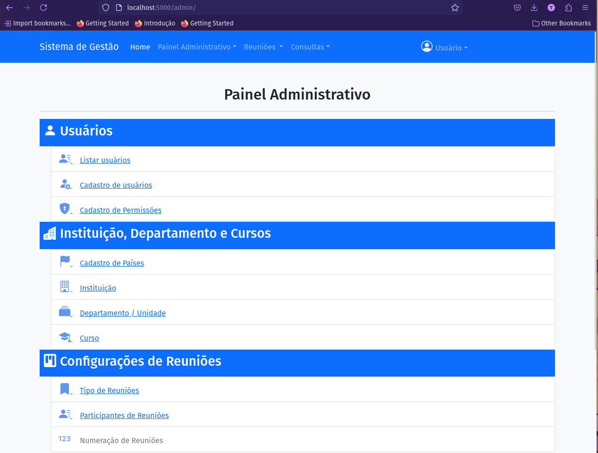
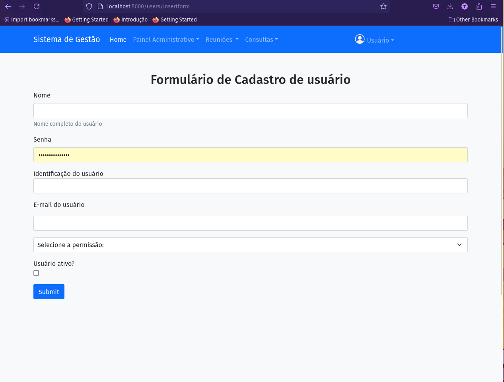

# Aplicação Web para gerenciar reuniões e Atas

## Introdução

um sistema para gerenciamento de atas das reuniões de forma que seja fácil a busca por palavras chaves como assuntos, protocolos, interessado entre outras informações. Para o desenvolvimento do projeto foram estabelecidos:

* Objetivo:
    * sistema para gerenciar a atas e informações indexáveis;
    * gerar atas automática a partir dos dados cadastrados

* Funções funcionais:
    * Cadastro de ATAs;
    * ferramenta para gerar a ata em pdf;
    * Ferramenta de pesquisa;
* Funções não-funcionais:
    * desenvolvimento utilizando stack de código livre;
    * utilização de banco de dados de código livre;
* Restrições:
    * deve possuir autenticação e controle de permissão;
    * deve possuir forma de realizar backup

A aplicação ainda está no estágio inicial de desenvolvimento.

## Aplicação em ambiente de teste:

Para testar a aplicação pode ser criando um ambiente virtual do python e instalar as dependências com:

``` bash
pip3 install -r requirements.txt
```

Em seguida entre na pasta src, e rode:

``` bash
flask run --debug

```


## Configurações 

Configurações da senha e e-amil do administrador deve ser realizado no arquivo .env.admin, conforme o exemplo abaixo: 

``` ENV

ADMIN_EMAIL= "teste@teste.com.br"
USER_PASSWORD="123456789"

```

Também deve ser criado um arquivo .env com os seguintes dados:

``` env
# Configuration Mode => development, testing, staging, or production
CONFIG_MODE = development

DEVELOPMENT_DATABASE_URL = "sqlite:///dev.db"
TEST_DATABASE_URL        = "sqlite:///test.db"
STAGING_DATABASE_URL     = "sqlite:///staging.db"
PRODUCTION_DATABASE_URL  = "sqlite:///production.db"


# JWT configuration 

SECRETE_KEY = "SENHASECRETA"
JWT_SECRET_KEY = "TSENHASECRETA"

```

## Configurações iniciais:

Dados iniciais necessárias:

1. Cadastro dos países;
2. Instituição;
3. Departamento ou unidade;
4. curso;
5. Tipo de reuniões;
6. Participantes;


## Capturas de tela da aplicação

* Cadastro de usuário;

* Painel administrativo para configuração básica



* Painel de cadastro de usuário 

